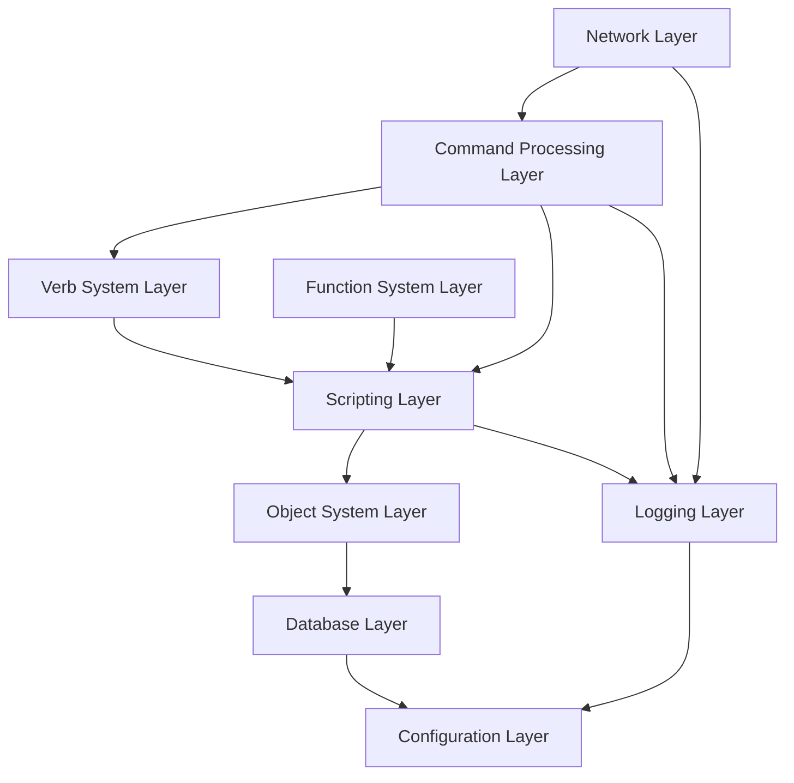
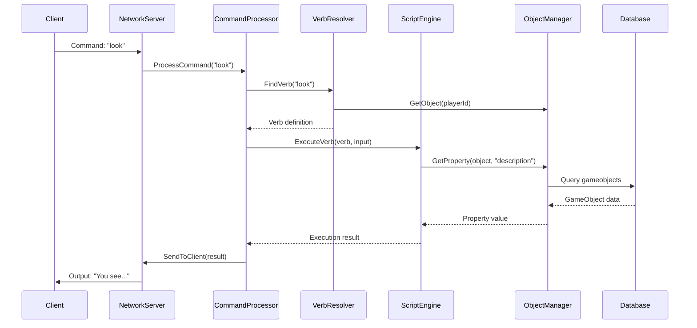

# CSMOO Architecture Overview

## System Overview

CSMOO (C# Multi-User Shared Object-Oriented Environment) is a modern reimplementation of LambdaMOO/PennMUSH-style virtual environment servers. It provides a programmable, multi-user text-based world where users can interact with objects and each other through a sophisticated scripting system.

### Key Characteristics

- **LambdaMOO-style Object System**: Objects with class inheritance and instance overrides
- **C# Roslyn Scripting**: Full C# language support for in-game programming
- **Multi-Protocol Support**: Telnet (port 1701), WebSocket (port 1702), and HTTP
- **NoSQL Database**: LiteDB for flexible, schema-less persistence
- **Hot Reload**: Update verb definitions without server restart
- **Dependency Injection**: Migrating from static singletons to DI-based architecture

## Architecture Layers

The CSMOO architecture is organized into 9 distinct layers, each with specific responsibilities:

### 1. Configuration Layer (`Configuration/`)

**Purpose**: Manages application configuration and settings

**Key Components**:
- `IConfig` / `Config`: Main configuration interface and implementation
- `ServerConfig`: Server port and runtime settings
- `DatabaseConfig`: Database file paths and connection settings
- `LoggingConfig`: Log file configuration
- `ScriptingConfig`: Script execution limits (timeout, call depth)

**Responsibilities**:
- Loading configuration from `config.json`
- Providing typed access to configuration values
- Validating configuration at startup

**Dependencies**: None (foundation layer)

**Consumed By**: All other layers

### 2. Logging Layer (`Logging/`)

**Purpose**: Centralized logging and diagnostic output

**Key Components**:
- `ILogger` / `LoggerInstance`: Logging interface and implementation
- Static `Logger` wrapper for backward compatibility

**Responsibilities**:
- File-based logging with rotation
- Console output formatting
- Log levels (Info, Warning, Error, Debug, Game)
- Banner and section header display

**Dependencies**: Configuration Layer

**Consumed By**: All layers that need logging

### 3. Database Layer (`Database/`)

**Purpose**: Data persistence and database abstraction

**Key Components**:
- `IGameDatabase` / `GameDatabase`: LiteDB wrapper and interface
- `IDbProvider` / `DbProvider`: High-level database operations
- `IDbCollection<T>`: Collection abstraction for LiteDB
- `LiteCollectionAdapter<T>`: Adapter implementation

**Database Collections**:
- `gameobjects`: GameObject instances
- `objectclasses`: ObjectClass definitions
- `players`: Player accounts and data
- `verbs`: Verb definitions (stored as JSON)
- `functions`: Function definitions

**Responsibilities**:
- Database connection management
- CRUD operations on game data
- Index management for performance
- Transaction handling

**Dependencies**: Configuration Layer, Logging Layer

**Consumed By**: Object System Layer, Verb System Layer, Function System Layer

### 4. Object System Layer (`Object/`)

**Purpose**: Core domain entities - objects, classes, properties, and inheritance

**Key Components**:
- `IObjectManager` / `ObjectManagerInstance`: Object lifecycle management
- `IClassManager` / `ClassManagerInstance`: Class definition management
- `IInstanceManager` / `InstanceManagerInstance`: Instance creation and location management
- `IPropertyManager` / `PropertyManagerInstance`: Property inheritance and access
- `GameObject`: Runtime object instances (extends DynamicObject)
- `ObjectClass`: Class definitions/templates
- `Player`: Player-specific object type
- `Room`: Room/location objects
- `Container`: Objects that can contain other objects

**Key Features**:
- **Class Inheritance**: Classes can inherit from parent classes
- **Property Inheritance**: Instances inherit default properties from classes
- **Dynamic Properties**: Properties stored as BsonDocument for flexibility
- **Object Location**: Hierarchical location system (objects in rooms/containers)
- **DBREF System**: Numeric references (#1, #2, etc.) for user addressing

**Responsibilities**:
- Object creation, update, and deletion
- Class hierarchy management
- Property resolution (instance → class → parent class)
- Location/spatial relationships
- Object caching for performance

**Dependencies**: Database Layer, Configuration Layer, Logging Layer

**Consumed By**: Scripting Layer, Verb System Layer, Command Processing Layer, Network Layer

### 5. Scripting Layer (`Scripting/`)

**Purpose**: C# code compilation and execution using Roslyn

**Key Components**:
- `ScriptEngine`: Main script execution engine
- `IScriptEngineFactory` / `ScriptEngineFactory`: Factory for creating script engines
- `ScriptGlobals`: Global variables and functions available in scripts
- `AdminScriptGlobals`: Extended globals for admin scripts
- `ScriptHelpers`: Helper methods for script execution context
- `ScriptObject`: Object wrapper for script access
- `ScriptObjectManager`: Manager wrapper for script access
- `ScriptPreprocessor`: Code preprocessing (object references, collections)

**Key Features**:
- **Roslyn Integration**: Full C# language support
- **Script Context**: Access to game objects, players, and APIs
- **Timeout Protection**: Configurable execution time limits
- **Call Depth Limits**: Prevents infinite recursion
- **Error Handling**: Detailed error reporting with stack traces
- **Hot Reload**: Support for updating scripts without restart

**Responsibilities**:
- Compiling C# code strings into executable scripts
- Providing script execution environment
- Managing script globals and context
- Handling script errors and timeouts
- Preprocessing object reference syntax (#1, class:Name, etc.)

**Dependencies**: Object System Layer, Verb System Layer, Function System Layer, Configuration Layer, Logging Layer

**Consumed By**: Verb System Layer, Function System Layer, Command Processing Layer

### 6. Verb System Layer (`Verbs/`)

**Purpose**: Command/action system for user interactions

**Key Components**:
- `IVerbManager` / `VerbManagerInstance`: Verb CRUD operations
- `IVerbResolver` / `VerbResolverInstance`: Verb matching and resolution
- `IVerbInitializer` / `VerbInitializerInstance`: Loading verbs from database/files
- `Verb`: Verb definition data structure

**Key Features**:
- **Verb Inheritance**: Objects inherit verbs from their class hierarchy
- **Pattern Matching**: Advanced command parsing with variable extraction
- **Verb Overrides**: Instance verbs can override class verbs
- **JSON Storage**: Verbs stored as JSON definitions
- **Hot Reload**: `@verbreload` command to refresh verb definitions

**Responsibilities**:
- Verb definition management
- Command-to-verb resolution
- Verb inheritance resolution
- Pattern matching for command parsing
- Loading verbs from resources and database

**Dependencies**: Database Layer, Object System Layer, Scripting Layer, Logging Layer

**Consumed By**: Command Processing Layer

### 7. Function System Layer (`Functions/`)

**Purpose**: Reusable script functions that can be called from verbs

**Key Components**:
- `IFunctionManager` / `FunctionManagerInstance`: Function CRUD operations
- `IFunctionResolver` / `FunctionResolverInstance`: Function lookup and resolution
- `IFunctionInitializer` / `FunctionInitializerInstance`: Loading functions from database/files
- `GameFunction`: Function definition data structure
- `Function`: Function metadata

**Key Features**:
- **Global Functions**: Functions available across all objects
- **Function Parameters**: Typed parameters with validation
- **Function Calls**: Call functions from verb code using `CallFunction()`
- **Hot Reload**: Support for reloading function definitions

**Responsibilities**:
- Function definition management
- Function resolution and lookup
- Function execution via ScriptEngine
- Loading functions from resources and database

**Dependencies**: Database Layer, Object System Layer, Scripting Layer, Logging Layer

**Consumed By**: Scripting Layer, Command Processing Layer

### 8. Network Layer (`Network/`)

**Purpose**: Multi-protocol server support for client connections

**Key Components**:
- `TelnetServer`: Traditional telnet server (port 1701)
- `WebSocketServer`: Modern WebSocket server (port 1702)
  - Text channel (`/ws`): Telnet-like text communication
  - JSON API channel (`/api`): Structured data communication
- `HttpServer`: HTTP server for web interface and static files
- `WebSocketSession`: WebSocket session management
- `IClientConnection` / `TelnetConnection` / `WebSocketConnection`: Connection abstractions

**Key Features**:
- **Multi-Protocol**: Telnet, WebSocket, and HTTP support
- **Session Management**: Track active connections
- **Unicode Support**: Full UTF-8 encoding
- **Concurrent Connections**: Async/await for scalability
- **Channel Types**: Different communication channels for WebSocket

**Responsibilities**:
- Accepting client connections
- Managing connection lifecycle
- Routing messages to CommandProcessor
- Handling protocol-specific details (telnet negotiation, WebSocket frames)
- Serving static files (HTTP)

**Dependencies**: Command Processing Layer, Logging Layer, Sessions Layer

**Consumed By**: Main application (Program.cs)

### 9. Command Processing Layer (`Commands/`)

**Purpose**: User command parsing and execution

**Key Components**:
- `CommandProcessor`: Main command handler (created per connection)
- `ProgrammingCommands`: Admin/programming commands (@create, @program, etc.)
- `ScriptCommands`: Script execution commands

**Key Features**:
- **Command Routing**: Routes commands to appropriate handlers
- **Built-in Commands**: Login, logout, quit, look, etc.
- **Programming Interface**: @-prefixed admin commands
- **Script Execution**: Direct script execution for testing
- **Multi-line Input**: Support for multi-line verb/property editing

**Responsibilities**:
- Parsing user input
- Routing commands to verbs or built-in handlers
- Managing player sessions
- Handling authentication and login
- Formatting output to clients

**Dependencies**: Verb System Layer, Scripting Layer, Object System Layer, Functions Layer, Sessions Layer, Logging Layer

**Consumed By**: Network Layer

## Supporting Layers

### Sessions Layer (`Sessions/`)

**Purpose**: Session and connection management

**Components**:
- `ISessionHandler` / `SessionHandlerInstance`: Centralized session management
- `IClientConnection`: Connection abstraction interface
- `SessionInfo`: Session metadata

### Initialization Layer (`Init/`)

**Purpose**: Server startup and initialization

**Components**:
- `ServerInitializer`: Main initialization orchestrator
- `IWorldInitializer` / `WorldInitializerInstance`: World setup (rooms, core classes)
- `IHotReloadManager` / `HotReloadManagerInstance`: Hot reload for verbs/functions
- `ICoreHotReloadManager` / `CoreHotReloadManagerInstance`: Hot reload for core classes

### Core Utilities (`Core/`)

**Purpose**: Shared utilities and built-in functions

**Components**:
- `Builtins` / `BuiltinsInstance`: Built-in functions for scripts (Say, GetProperty, etc.)
- `IObjectResolver` / `ObjectResolverInstance`: Resolving object references from strings
- `Html`: HTML utility functions
- `StringBuilder`: Enhanced string building utilities

### Exceptions (`Exceptions/`)

**Purpose**: Domain-specific exception types

**Components**:
- Various exception types for different error scenarios
- Script execution exceptions with detailed context

## Dependency Flow

The layers form a dependency hierarchy where:

1. **Foundation Layers** (no dependencies on other business logic):
   - Configuration Layer
   - Logging Layer
   - Database Layer

2. **Domain Layers** (depend on foundation):
   - Object System Layer
   - Verb System Layer
   - Function System Layer

3. **Execution Layers** (depend on domain):
   - Scripting Layer

4. **Presentation Layers** (depend on execution and domain):
   - Command Processing Layer
   - Network Layer

## Key Design Patterns

### 1. Dependency Injection (Migrating)

**Current State**: Mid-migration from static singletons to DI
- All major components have interface/implementation pairs
- Static wrapper classes exist for backward compatibility
- DI container configured in `Program.ConfigureServices()`

**Pattern**: Services registered as singletons in DI container, injected via constructors

### 2. Factory Pattern

**Usage**: 
- `IScriptEngineFactory`: Creates ScriptEngine instances with proper dependencies
- `ICoreClassFactory`: Creates core classes (Room, Player, etc.)

### 3. Manager Pattern

**Usage**: Multiple "Manager" classes coordinate related operations:
- ObjectManager: Object lifecycle
- ClassManager: Class definitions
- VerbManager: Verb definitions
- FunctionManager: Function definitions
- PlayerManager: Player sessions
- RoomManager: Spatial relationships

### 4. Static Wrapper Pattern (Legacy)

**Usage**: For backward compatibility during DI migration:
- Static classes delegate to instance implementations
- Allows gradual migration of codebase
- Will be removed once migration is complete

### 5. DynamicObject Pattern

**Usage**: `GameObject` extends `DynamicObject` to allow:
- Dynamic property access: `obj.name` instead of `GetProperty(obj, "name")`
- Natural scripting syntax

## Data Flow: Command Execution

## Configuration and Startup

The application follows this startup sequence:

1. **Configuration Loading**: Load `config.json` into `IConfig`
2. **DI Container Setup**: Register all services in `ConfigureServices()`
3. **Service Resolution**: Create singletons and resolve circular dependencies
4. **Static Instance Setup**: Set static wrappers for backward compatibility
5. **Database Initialization**: Initialize LiteDB connections
6. **World Initialization**: Create core classes, starting room, default admin
7. **Verb/Function Loading**: Load verb and function definitions from database/files
8. **Hot Reload Setup**: Initialize file watchers for hot reload
9. **Server Startup**: Start Telnet, WebSocket, and HTTP servers

## Security Considerations

- **Script Execution Limits**: Configurable timeout and call depth limits
- **Permission System**: Flag-based permissions for admin operations
- **Sandboxing**: Scripts run in isolated context with limited APIs
- **Input Validation**: Command parsing validates input before execution
- **Connection Management**: Session tracking prevents resource leaks

## Performance Characteristics

- **Object Caching**: Frequently accessed objects cached in memory
- **Database Indexing**: LiteDB indexes on common query fields (Id, Name, Location)
- **Async Operations**: Network I/O is fully asynchronous
- **Singleton Pattern**: Services are singletons to reduce instantiation overhead
- **Lazy Loading**: Objects loaded on-demand from database

## Future Architecture Goals

The current architecture is being refactored toward:

1. **Domain-Based Architecture**: Clear domain boundaries with proper contracts
2. **Complete DI Migration**: Remove all static wrappers
3. **Better Separation of Concerns**: Reduce coupling between layers
4. **Improved Testability**: Make components easier to unit test
5. **Plugin System**: Extensibility through plugin architecture
