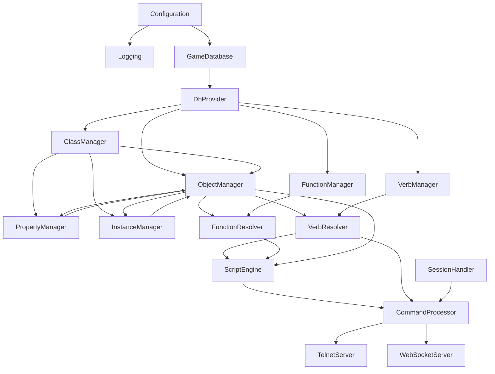

# CSMOO Component Documentation

This document provides detailed information about major components in the CSMOO system, their interfaces, dependencies, consumers, and usage patterns.

## Component Index

1. [Object Manager System](#object-manager-system)
2. [Scripting Engine](#scripting-engine)
3. [Verb System](#verb-system)
4. [Database Abstraction](#database-abstraction)
5. [Network Servers](#network-servers)
6. [Command Processing](#command-processing)
7. [Session Management](#session-management)
8. [Property Management](#property-management)
9. [Class Management](#class-management)
10. [Instance Management](#instance-management)

---

## Object Manager System

### Purpose

The Object Manager System is the core domain layer responsible for managing game objects (instances), classes (templates), their relationships, and properties. It provides the foundation for the LambdaMOO-style object system.

### Key Components

#### `IObjectManager` / `ObjectManagerInstance`

**Purpose**: Central coordinator for object lifecycle and operations

**Interface**: `IObjectManager`  
**Implementation**: `ObjectManagerInstance`

**Key Responsibilities**:
- Object CRUD operations (Get, Create, Update, Delete)
- Object caching for performance
- Subtype conversion (GameObject → Room, Player, Item, etc.)
- Delegation to specialized managers (PropertyManager, InstanceManager, ClassManager)
- DBREF resolution (numeric references like #1, #2)

**Dependencies**:
- `IDbProvider`: Database access
- `IClassManager`: Class definitions
- `IPropertyManager`: Property operations (set via `SetPropertyManager()`)
- `IInstanceManager`: Instance operations (set via `SetInstanceManager()`)

**Consumers**:
- `CommandProcessor`: Object lookups and operations
- `ScriptEngine`: Object access in scripts
- `VerbResolver`: Object resolution for verb execution
- `RoomManager`: Object location management
- All scripting globals

**Lifecycle**: Singleton (registered in DI container)

**Key Methods**:
```csharp
GameObject? GetObject(string objectId)
GameObject? GetObject<T>(string objectId) where T : GameObject
GameObject? GetObjectByDbRef(int dbRef)
GameObject CreateInstance(string classId, string? location = null)
bool UpdateObject(GameObject gameObject)
bool DestroyInstance(string objectId)
BsonValue? GetProperty(GameObject obj, string propertyName)
void SetProperty(GameObject obj, string propertyName, BsonValue value)
```

**Example Usage**:
```csharp
// Get object by ID
var player = objectManager.GetObject<Player>("player-id-123");

// Get object by DBREF
var sword = objectManager.GetObjectByDbRef(42);

// Create new instance
var newRoom = objectManager.CreateInstance(roomClassId, null);

// Access properties
var health = objectManager.GetProperty(player, "health");
objectManager.SetProperty(player, "health", 100);
```

**Circular Dependency Resolution**: 
ObjectManager has circular dependencies with PropertyManager and InstanceManager. These are resolved via setter injection after DI container creation.

---

#### `IClassManager` / `ClassManagerInstance`

**Purpose**: Manages class definitions and inheritance hierarchies

**Interface**: `IClassManager`  
**Implementation**: `ClassManagerInstance`

**Key Responsibilities**:
- Class CRUD operations
- Inheritance chain resolution
- Subclass queries
- Class validation

**Dependencies**:
- `IDbProvider`: Database access
- `ILogger`: Logging

**Consumers**:
- `ObjectManagerInstance`: Delegates class operations
- `CoreClassFactory`: Creates core classes
- `WorldInitializer`: Sets up initial class hierarchy

**Key Methods**:
```csharp
ObjectClass CreateClass(string name, string? parentClassId, string description)
List<ObjectClass> GetInheritanceChain(string classId)
bool InheritsFrom(string childClassId, string parentClassId)
List<ObjectClass> GetSubclasses(string parentClassId, bool recursive = true)
```

---

#### `IPropertyManager` / `PropertyManagerInstance`

**Purpose**: Handles property inheritance and access

**Interface**: `IPropertyManager`  
**Implementation**: `PropertyManagerInstance`

**Key Responsibilities**:
- Property resolution (instance → class → parent class chain)
- Property get/set operations
- Property inheritance from classes

**Dependencies**:
- `IDbProvider`: Database access
- `IClassManager`: Class hierarchy lookup
- `IObjectManager`: Object access (circular dependency)

**Consumers**:
- `ObjectManagerInstance`: Delegates property operations
- Scripting system: Property access from scripts

**Key Methods**:
```csharp
BsonValue? GetProperty(GameObject obj, string propertyName)
void SetProperty(GameObject obj, string propertyName, BsonValue value)
bool HasProperty(GameObject obj, string propertyName)
string[] GetAllPropertyNames(GameObject obj)
```

**Property Resolution Order**:
1. Instance properties (highest priority)
2. Class properties (from object's class)
3. Parent class properties (recursive up inheritance chain)

---

#### `IInstanceManager` / `InstanceManagerInstance`

**Purpose**: Manages object instances and spatial relationships

**Interface**: `IInstanceManager`  
**Implementation**: `InstanceManagerInstance`

**Key Responsibilities**:
- Instance creation and destruction
- Object movement between locations
- Location queries (what objects are in a location)
- Class-based object queries

**Dependencies**:
- `IDbProvider`: Database access
- `IClassManager`: Class definitions
- `IObjectManager`: Object access (circular dependency)
- `IPropertyManager`: Property operations (circular dependency)

**Consumers**:
- `ObjectManagerInstance`: Delegates instance operations
- `RoomManager`: Spatial operations
- Scripting system: Location-based queries

**Key Methods**:
```csharp
GameObject CreateInstance(string classId, string? location = null)
bool DestroyInstance(string objectId)
bool MoveObject(string objectId, string? newLocationId)
List<GameObject> GetObjectsInLocation(string? locationId)
List<GameObject> FindObjectsByClass(string classId, bool includeSubclasses = true)
```

---

## Scripting Engine

### Purpose

The Scripting Engine compiles and executes C# code using Roslyn, providing the runtime environment for verbs and functions.

### Key Components

#### `ScriptEngine`

**Purpose**: Main script execution engine using Microsoft.CodeAnalysis.CSharp.Scripting

**Dependencies**:
- `IObjectManager`: Object access
- `ILogger`: Error logging
- `IConfig`: Execution limits (timeout, call depth)
- `IObjectResolver`: Object reference resolution
- `IVerbResolver`: Verb resolution for script calls
- `IFunctionResolver`: Function resolution
- `IDbProvider`: Database access
- `IPlayerManager`: Player access
- `IVerbManager`: Verb management
- `IRoomManager`: Room operations

**Consumers**:
- `CommandProcessor`: Executes verb code
- `Builtins.ExecuteScript()`: Direct script execution

**Key Methods**:
```csharp
string ExecuteVerb(Verb verb, string input, Player player, CommandProcessor processor, string? thisObjectId = null, Dictionary<string, string>? variables = null)
object? ExecuteFunction(GameFunction function, Player player, CommandProcessor processor, string? thisObjectId = null, object[]? parameters = null)
```

**Features**:
- Full C# language support (LINQ, async/await, generics, etc.)
- Configurable execution timeout
- Call depth limits (prevents infinite recursion)
- Object reference preprocessing (#1, class:Name syntax)
- Collection expression preprocessing
- Error handling with stack traces

**Example Usage**:
```csharp
var engine = scriptEngineFactory.Create();
var result = engine.ExecuteVerb(
    verb: verbDefinition,
    input: "look",
    player: currentPlayer,
    processor: commandProcessor,
    thisObjectId: objectId
);
```

---

#### `IScriptEngineFactory` / `ScriptEngineFactory`

**Purpose**: Factory for creating ScriptEngine instances with proper dependencies

**Interface**: `IScriptEngineFactory`  
**Implementation**: `ScriptEngineFactory`

**Key Method**:
```csharp
ScriptEngine Create()
```

Creates a new ScriptEngine instance with all required dependencies injected.

---

#### `ScriptGlobals`

**Purpose**: Global variables and functions available to all scripts

**Key Properties**:
- `Player`: Current player executing the script
- `This`: Current object context
- `Args`: Command arguments
- `Input`: Raw command input
- `Helpers`: ScriptHelpers instance for utility methods

**Key Methods** (via Builtins):
- `Say(string message)`: Send message to player
- `SayToRoom(string message)`: Broadcast message to room
- `GetProperty(GameObject obj, string name)`: Get property value
- `SetProperty(GameObject obj, string name, object value)`: Set property
- `CallVerb(string objectId, string verbName, params object[] args)`: Call verb on object
- `CallFunction(string functionName, params object[] args)`: Call global function

---

#### `ScriptHelpers`

**Purpose**: Helper methods and utilities for script execution context

**Key Methods**:
- Object lookup and resolution
- Player management operations
- Room operations
- Database operations

---

## Verb System

### Purpose

The Verb System manages commands/actions that can be executed on objects, with support for inheritance and pattern matching.

### Key Components

#### `IVerbManager` / `VerbManagerInstance`

**Purpose**: CRUD operations for verb definitions

**Interface**: `IVerbManager`  
**Implementation**: `VerbManagerInstance`

**Dependencies**:
- `IDbProvider`: Database access

**Key Methods**:
```csharp
Verb? GetVerb(string verbId)
List<Verb> GetVerbsForObject(string objectId)
Verb CreateVerb(string objectId, string name, string code, string? pattern = null)
bool UpdateVerb(Verb verb)
bool DeleteVerb(string verbId)
```

---

#### `IVerbResolver` / `VerbResolverInstance`

**Purpose**: Resolves user commands to verb definitions with pattern matching

**Interface**: `IVerbResolver`  
**Implementation**: `VerbResolverInstance`

**Dependencies**:
- `IDbProvider`: Database access
- `IObjectManager`: Object lookup
- `ILogger`: Logging

**Consumers**:
- `CommandProcessor`: Command-to-verb resolution
- `ScriptEngine`: Verb calls from scripts

**Key Methods**:
```csharp
VerbMatchResult? FindMatchingVerbWithVariables(string objectId, string[] commandArgs, bool includeSystemVerbs = true)
Verb? FindMatchingVerb(string objectId, string[] commandArgs, bool includeSystemVerbs = true)
```

**Resolution Process**:
1. Check instance verbs (exact name match)
2. Check instance verb aliases
3. Check class verbs (walking up inheritance chain)
4. Pattern matching on verbs with patterns
5. System verbs (fallback)

**Pattern Matching**: Supports variable extraction from command patterns (e.g., "get $object" → extracts "object" variable)

---

#### `IVerbInitializer` / `VerbInitializerInstance`

**Purpose**: Loads verb definitions from database and resource files

**Interface**: `IVerbInitializer`  
**Implementation**: `VerbInitializerInstance`

**Dependencies**:
- `IDbProvider`: Database access
- `ILogger`: Logging
- `IObjectManager`: Object lookup

**Key Methods**:
```csharp
void LoadAndCreateVerbs()
```

Loads verbs from:
- Database (`verbs` collection)
- Resource files (`Resources/functions/*.cs`)

---

## Database Abstraction

### Purpose

Provides a clean abstraction layer over LiteDB, with support for caching and type conversion.

### Key Components

#### `IGameDatabase` / `GameDatabase`

**Purpose**: LiteDB wrapper providing collection access

**Interface**: `IGameDatabase`  
**Implementation**: `GameDatabase`

**Dependencies**:
- `IConfig`: Database file path

**Key Methods**:
```csharp
ILiteCollection<T> GetCollection<T>(string name)
void Dispose()
```

**Collections**:
- `gameobjects`: GameObject instances
- `objectclasses`: ObjectClass definitions
- `players`: Player accounts
- `verbs`: Verb definitions
- `functions`: Function definitions

**Lifecycle**: Singleton (disposed on shutdown)

---

#### `IDbProvider` / `DbProvider`

**Purpose**: High-level database operations with caching integration

**Interface**: `IDbProvider`  
**Implementation**: `DbProvider`

**Dependencies**:
- `IGameDatabase`: Database access
- `IObjectManager`: Object caching (set via `SetObjectManager()`)

**Consumers**: All components that need database access

**Key Methods**:
```csharp
void Insert<T>(string collectionName, T item)
bool Update<T>(string collectionName, T item)
bool Delete<T>(string collectionName, string id)
IEnumerable<T> FindAll<T>(string collectionName)
IEnumerable<T> Find<T>(string collectionName, Func<T, bool> predicate)
T? FindOne<T>(string collectionName, Func<T, bool> predicate)
T? FindById<T>(string collectionName, string id)
```

**Special Behavior**: Automatically updates ObjectManager cache when GameObject instances are retrieved.

---

## Network Servers

### Purpose

Multi-protocol server support for client connections (Telnet, WebSocket, HTTP).

### Key Components

#### `TelnetServer`

**Purpose**: Traditional telnet server on port 1701

**Dependencies**:
- `IServiceProvider`: For creating CommandProcessor instances
- `ILogger`: Logging

**Key Responsibilities**:
- Accept TCP connections
- Create CommandProcessor per connection
- Route input to CommandProcessor
- Handle connection lifecycle

**Lifecycle**: Created in `Program.Main()`, runs until server shutdown

**Example Usage**:
```csharp
var telnetServer = new TelnetServer(port, serviceProvider);
telnetServer.Start(); // Blocking call
```

---

#### `WebSocketServer`

**Purpose**: Modern WebSocket server on port 1702 with multiple channels

**Dependencies**:
- `IServiceProvider`: For creating CommandProcessor instances
- `ILogger`: Logging

**Channels**:
- `/ws`: Text channel (telnet-like)
- `/api`: JSON API channel (structured data)

**Key Responsibilities**:
- Accept WebSocket connections
- Handle different channel types
- Create CommandProcessor per session
- Route messages to CommandProcessor
- JSON message handling for API channel

**Lifecycle**: Created in `Program.Main()`, runs asynchronously

---

#### `HttpServer`

**Purpose**: HTTP server for web interface and static file serving

**Dependencies**:
- `IConfig`: Configuration
- `ILogger`: Logging
- `IObjectManager`: Object access

**Key Responsibilities**:
- Serve static files (HTML, CSS, etc.)
- Handle HTTP requests
- Provide web-based game interface

---

## Command Processing

### Purpose

Parses user input and routes commands to appropriate handlers (verbs, built-in commands, etc.).

### Key Components

#### `CommandProcessor`

**Purpose**: Main command handler created per connection

**Dependencies** (17 total):
- `IPlayerManager`: Player management
- `IVerbResolver`: Verb resolution
- `IPermissionManager`: Permission checking
- `IObjectManager`: Object access
- `IFunctionResolver`: Function resolution
- `IDbProvider`: Database access
- `IGameDatabase`: Database access
- `ILogger`: Logging
- `IRoomManager`: Room operations
- `IScriptEngineFactory`: Script execution
- `IVerbManager`: Verb management
- `IFunctionManager`: Function management
- `IHotReloadManager`: Hot reload (optional)
- `ICoreHotReloadManager`: Core hot reload (optional)
- `IFunctionInitializer`: Function initialization (optional)
- `IPropertyInitializer`: Property initialization (optional)
- `IClientConnection`: Connection abstraction

**Consumers**: Network servers (TelnetServer, WebSocketServer)

**Key Responsibilities**:
- Parse user input
- Route commands to verbs or built-in handlers
- Handle authentication and login
- Format output to client
- Manage multi-line input (verb/property editing)
- Execute built-in commands (look, quit, etc.)

**Key Methods**:
```csharp
void ProcessCommand(string input)
void SendToPlayer(string message)
void DisplayLoginBanner()
```

**Lifecycle**: Created per connection, lives until connection closes

---

#### `ProgrammingCommands`

**Purpose**: Handles @-prefixed admin/programming commands

**Dependencies**: Same as CommandProcessor (17 dependencies)

**Key Commands**:
- `@create`: Create new objects
- `@program`: Edit verb code
- `@property`: Manage properties
- `@verbreload`: Hot reload verbs
- `@functions`: Function management
- And many more...

---

## Session Management

### Purpose

Tracks active connections and manages player sessions.

### Key Components

#### `ISessionHandler` / `SessionHandlerInstance`

**Purpose**: Centralized session tracking

**Interface**: `ISessionHandler`  
**Implementation**: `SessionHandlerInstance`

**Dependencies**:
- `IPlayerManager`: Player management

**Consumers**: Network servers

**Key Methods**:
```csharp
void AddSession(Guid clientGuid, IClientConnection connection)
bool RemoveSession(Guid clientGuid)
bool LoginPlayer(Guid sessionGuid, string playerName, string password)
Player? GetPlayerForSession(Guid sessionGuid)
```

**Lifecycle**: Singleton

---

#### `IClientConnection` / `TelnetConnection` / `WebSocketConnection`

**Purpose**: Connection abstraction for protocol independence

**Interface**: `IClientConnection`

**Implementations**:
- `TelnetConnection`: Wraps TcpClient
- `WebSocketConnection`: Wraps WebSocket

**Key Methods**:
```csharp
void Send(string message)
void Disconnect()
```

---

## Property Management

See [IPropertyManager / PropertyManagerInstance](#ipropertymanager--propertymanagerinstance) under Object Manager System.

---

## Class Management

See [IClassManager / ClassManagerInstance](#iclassmanager--classmanagerinstance) under Object Manager System.

---

## Instance Management

See [IInstanceManager / InstanceManagerInstance](#iinstancemanager--instancemanagerinstance) under Object Manager System.

---

## Component Dependency Graph



## Component Lifecycle

### Startup Sequence

1. Configuration loaded
2. DI container configured (`Program.ConfigureServices()`)
3. Singleton services created (in dependency order)
4. Circular dependencies resolved via setter injection
5. Static wrappers set (for backward compatibility)
6. Database initialized
7. World initialized (core classes, starting room)
8. Verbs/functions loaded
9. Hot reload initialized
10. Network servers started

### Shutdown Sequence

1. Network servers stopped
2. All players disconnected
3. Hot reload shut down
4. Database connections closed
5. Service provider disposed

## Testing Considerations

Many components are tightly coupled, making unit testing challenging:

- **ObjectManager** depends on PropertyManager and InstanceManager (circular)
- **CommandProcessor** has 17 dependencies
- **ScriptEngine** requires full game context

**Recommendations for Testing**:
- Use dependency injection for all dependencies
- Create interfaces for all external dependencies
- Use mocks/stubs for database and network operations
- Test components in isolation with mocked dependencies
