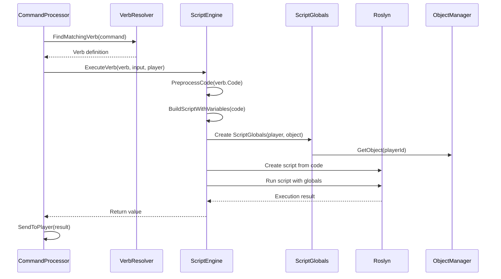

# Scripting Architecture

This document describes the CSMOO scripting system, which uses Microsoft.CodeAnalysis.CSharp.Scripting (Roslyn) to provide full C# language support for in-game programming.

## Overview

The scripting system allows users to write and execute C# code in verbs and functions. Code is compiled and executed at runtime using Roslyn, with access to game objects, players, and APIs through a carefully controlled execution context.

## Architecture Components

### Core Components

1. **ScriptEngine**: Main compilation and execution engine
2. **ScriptGlobals**: Execution context and global variables
3. **AdminScriptGlobals**: Extended context for admin scripts
4. **ScriptHelpers**: Utility methods for script execution
5. **ScriptPreprocessor**: Code preprocessing and transformation
6. **ScriptStackTrace**: Call stack tracking for error reporting

## Roslyn Integration

### ScriptOptions Configuration

The ScriptEngine configures Roslyn with:

**References**:
- System.Object, System.Console, System.Linq assemblies
- CSMOO game objects and managers
- HtmlAgilityPack (for HTML generation)

**Imports**:
- `System`, `System.Linq`, `System.Collections.Generic`
- `CSMOO.Core`, `CSMOO.Object`, `CSMOO.Exceptions`
- `System.Dynamic`

**Language Version**: Latest C# language features

```csharp
_scriptOptions = ScriptOptions.Default
    .WithLanguageVersion(LanguageVersion.Latest)
    .WithReferences(...)
    .WithImports(...);
```

### Script Compilation

Scripts are compiled using:

```csharp
var script = CSharpScript.Create(completeScript, _scriptOptions, typeof(ScriptGlobals));
```

The script code is compiled into an executable script object that can be run multiple times with different globals.

## Execution Flow

### Verb Execution Flow



### Function Execution Flow

Functions follow a similar flow but are called from other scripts rather than commands.

## Script Globals

### ScriptGlobals

The execution context provided to all scripts:

**Properties**:
- `Player`: Current `Player` object (Database.Player)
- `This`: Current object context (`GameObject`)
- `ThisObject`: Alias for `This`
- `Caller`: Object that called this verb/function
- `Args`: Parsed command arguments (`string[]`)
- `Input`: Raw command input (`string`)
- `Verb`: Name of current verb (`string`)
- `Variables`: Extracted pattern variables (`Dictionary<string, string>`)
- `CallDepth`: Current call depth (prevents infinite recursion)

**Managers** (wrapped for script safety):
- `ObjectManager`: `ScriptObjectManager` - Object operations
- `PlayerManager`: `ScriptPlayerManager` - Player operations
- `WorldManager`: `ScriptWorldManager` - World operations
- `Helpers`: `ScriptHelpers` - Utility methods

**Methods**:
- `Say(string message)`: Send message to player
- `SayToRoom(string message, bool excludeSelf)`: Broadcast to room
- `notify(Player player, string message)`: Send to specific player
- `obj(string reference)`: Resolve object reference
- `objById(string id)`: Get object by ID

### AdminScriptGlobals

Extends `ScriptGlobals` with additional admin capabilities:

- Access to admin-only operations
- Enhanced debugging features
- System-level operations

## Code Preprocessing

### Object Reference Preprocessing

Before compilation, object references are preprocessed:

**Syntax Transformations**:
- `#1`, `#42` → `ObjectManager.GetObjectByDbRef(1)`
- `class:Room` → `ObjectManager.GetClassByName("Room")`
- `this`, `me`, `here`, `system` → Resolved keywords

**Example**:
```csharp
// Input code:
var room = #5;
var player = me;

// Preprocessed:
var room = ObjectManager.GetObjectByDbRef(5);
var player = This; // or Player depending on context
```

### Collection Expression Preprocessing

Collection expressions are normalized:

```csharp
// Input:
var items = [obj1, obj2, obj3];

// Preprocessed:
var items = new List<dynamic> { obj1, obj2, obj3 };
```

### Variable Injection

Pattern-matched variables are injected into the script:

```csharp
// Verb pattern: "get $object"
// Command: "get sword"
// Variables: { "object": "sword" }

// Injected code:
var object = "sword"; // Variable from pattern
// ... rest of verb code
```

## Built-in Functions (Builtins)

The `Builtins` class provides a rich API available to all scripts:

### Object Operations
- `GetProperty(GameObject obj, string name)`: Get property value
- `SetProperty(GameObject obj, string name, object value)`: Set property
- `GetAllObjects()`: Get all game objects
- `GetObjectsInLocation(string locationId)`: Get objects in location
- `FindObject(string name)`: Find object by name

### Verb Operations
- `CallVerb(string objectId, string verbName, params object[] args)`: Call verb on object
- `This(string verbName, params object[] args)`: Call verb on current object
- `Me(string verbName, params object[] args)`: Call verb on player
- `Here(string verbName, params object[] args)`: Call verb on room
- `System(string verbName, params object[] args)`: Call verb on system object

### Function Operations
- `CallFunction(string functionName, params object[] args)`: Call global function

### Messaging
- `Say(string message)`: Send message to player
- `SayToRoom(string message)`: Broadcast to room
- `SayToObject(string objectId, string message)`: Send to specific object

### Utility Functions
- `Log(string message)`: Log to server console
- `ExecuteScript(string code)`: Execute C# code dynamically

See `Core/Builtins.cs` for complete API documentation.

## Security and Sandboxing

### Execution Limits

**Timeout Protection**:
- Configurable maximum execution time (default: 5000ms)
- Cancellation token passed to Roslyn
- `OperationCanceledException` caught and reported

**Call Depth Limits**:
- Prevents infinite recursion
- Configurable maximum depth (default: 50)
- Tracked via `CallDepth` in ScriptGlobals

**Code Restrictions**:
- No file system access (except through APIs)
- No network access (except through APIs)
- No reflection (limited)
- Controlled API access through Builtins

### Error Handling

**Exception Types**:
- `ScriptExecutionException`: Base exception for script errors
- `PermissionException`: Access denied errors
- `PropertyAccessException`: Property access errors
- `ContextException`: Missing context errors
- `FunctionExecutionException`: Function call errors

**Error Reporting**:
- Full stack traces with script locations
- HTML-formatted error output
- Stack frame tracking via `ScriptStackTrace`

## Stack Trace Management

### ScriptStackTrace

Tracks the call stack for verb/function execution:

**Features**:
- Push/pop frames for each verb/function call
- Store source code for error reporting
- Update frames with exception information
- Thread-local storage (each execution has its own stack)

**Usage**:
```csharp
ScriptStackTrace.PushVerbFrame(verb, object);
try {
    // Execute script
} catch (Exception ex) {
    ScriptStackTrace.UpdateCurrentFrame(ex, verb.Code);
    throw;
} finally {
    ScriptStackTrace.PopFrame();
}
```

## Hot Reload

### Overview

The scripting system supports hot reloading of verb and function definitions without server restart.

### Verb Hot Reload

**Trigger**:
- File watcher detects changes in `Resources/verbs/**/*.json`
- Manual command: `@verbreload` or `@reload verbs`

**Process**:
1. File watcher detects change
2. 500ms debounce delay (prevents multiple rapid reloads)
3. Clear existing verbs from database
4. Reload all verb JSON files
5. Re-initialize verb definitions
6. Notify online players

**Implementation**: `IHotReloadManager` / `HotReloadManagerInstance`

### Function Hot Reload

Similar process for functions in `Resources/functions/**/*.json`:

1. File watcher detects change
2. Debounce delay
3. Clear existing functions
4. Reload function JSON files
5. Re-initialize function definitions

### Script Engine Reload

The script engine itself doesn't need reloading - scripts are compiled fresh on each execution. However, the script options and globals can be updated.

## Execution Context

### Context Inheritance

When a verb calls another verb, the execution context is inherited:

```csharp
// Verb A calls Verb B
// Verb B inherits:
// - Same Player
// - Previous context's Helpers
// - Incremented CallDepth
// - Previous context stored for restoration
```

### Context Restoration

After nested calls, the previous context is restored:

```csharp
var previousContext = Builtins.UnifiedContext;
try {
    // Execute script
} finally {
    Builtins.UnifiedContext = previousContext; // Restore
}
```

## Performance Considerations

### Script Compilation

- **Cost**: Compilation is expensive (happens once per verb execution)
- **Caching**: Roslyn may cache compiled scripts internally
- **Optimization**: Pre-compile frequently used scripts (future enhancement)

### Execution Speed

- **Runtime**: Compiled scripts execute at near-native speed
- **Memory**: Each script execution creates new globals context
- **Garbage Collection**: Script objects are GC-eligible after execution

### Recommendations

1. **Keep scripts small**: Large scripts compile slower
2. **Avoid deep nesting**: Excessive call depth impacts performance
3. **Use functions**: Reusable functions reduce compilation overhead
4. **Cache frequently used data**: Avoid repeated object lookups

## Type System

### Dynamic Types

Scripts use `dynamic` extensively:

```csharp
dynamic obj = This; // GameObject as dynamic
var name = obj.name; // Dynamic property access
obj.doSomething(); // Dynamic method call
```

**Benefits**:
- Natural property access (`obj.name` vs `GetProperty(obj, "name")`)
- Subtype method access (Room, Player methods)
- Flexible API

**Limitations**:
- No compile-time type checking
- Runtime errors for missing properties/methods
- Some IDE features unavailable

### Type Conversion

Objects are converted to their correct subtypes:

- `GameObject` → `Room`, `Player`, `Item`, `Container`, `Exit`
- Handled by `ObjectManagerInstance.ConvertToSubtype()`
- Ensures subtype methods are available

## Example Script Execution

### Verb Code

```csharp
// Verb: "look"
Say($"You see {GetProperty(This, "description")}.");
var contents = GetObjectsInLocation(This.Id);
if (contents.Count > 0) {
    Say("You also see:");
    foreach (var item in contents) {
        Say($"  {GetProperty(item, "name")}");
    }
}
return "You look around.";
```

### Preprocessing

```csharp
// After preprocessing object references:
Say($"You see {GetProperty(This, "description")}.");
var contents = GetObjectsInLocation(This.Id);
// ... rest of code
```

### Execution

1. Create `ScriptGlobals` with player and object context
2. Preprocess code (object references, variables)
3. Build complete script with variable declarations
4. Compile with Roslyn
5. Execute with timeout protection
6. Handle return value (string or bool)
7. Report errors with stack trace

## Future Enhancements

### Planned Features

1. **Script Caching**: Cache compiled scripts for reuse
2. **Async Scripts**: Full async/await support
3. **Script Debugging**: Breakpoints and step-through debugging
4. **Script Profiling**: Performance metrics for scripts
5. **Script Validation**: Pre-compilation syntax checking

### Possible Improvements

1. **Incremental Compilation**: Only recompile changed scripts
2. **Script Optimization**: Roslyn optimization passes
3. **Type Inference**: Better type checking for scripts
4. **Script Templates**: Common script patterns as templates

## Related Documentation

- `HOT_RELOAD_GUIDE.md` - Hot reload usage guide
- `PROG_GUIDE.md` - Verb programming guide
- `COMPONENTS.md` - Component documentation
- `ARCHITECTURE.md` - Overall system architecture
